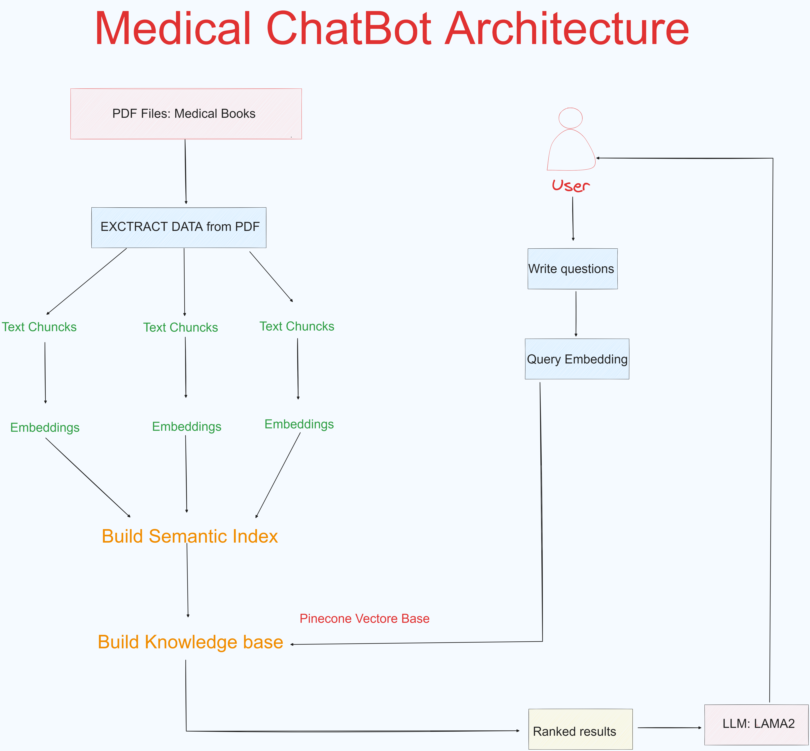

# Medical Chatbot with LLAM2: Project Overview

## Context:
In light of ongoing protests by medical students in Morocco against certain modifications to their curriculum, which they argue may compromise the quality of their education and international recognition of Moroccan diplomas, there has been a sustained period of exam boycotts. As a data scientist, I conceived the idea of developing a chatbot as an educational tool for students, leveraging course materials provided by instructors.

## Project Architecture
Please refer to the following image for an overview of the project architecture

 